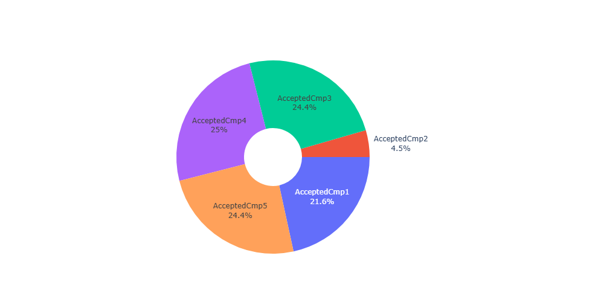
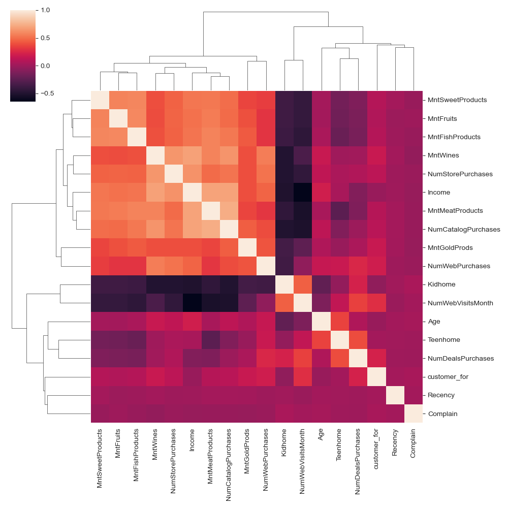
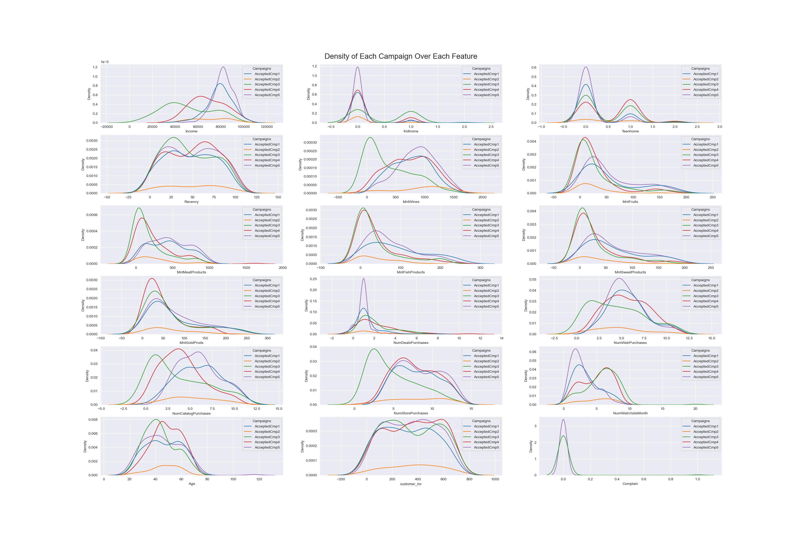
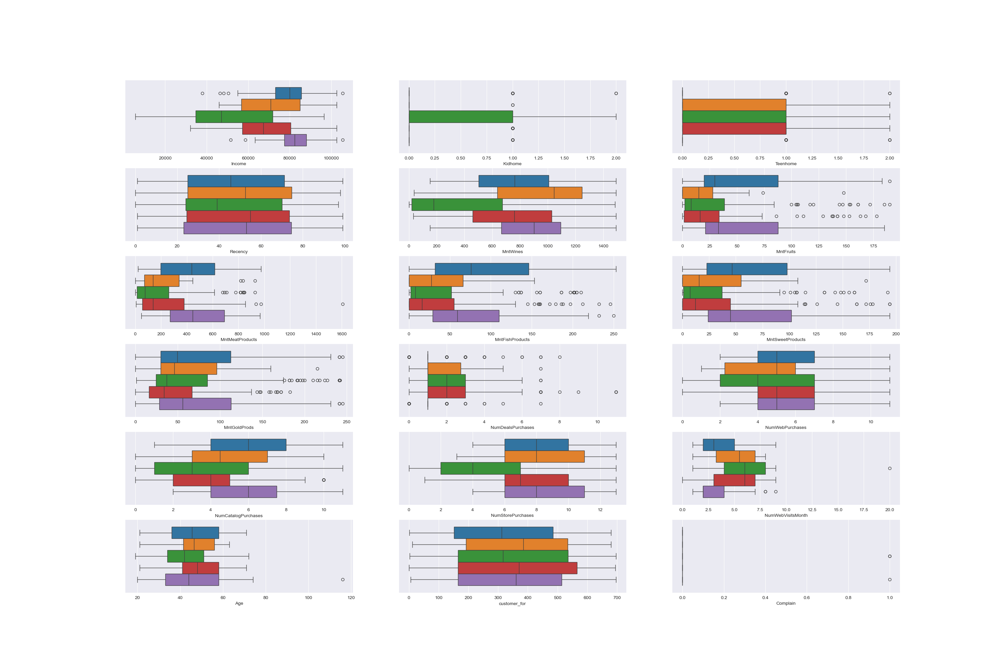
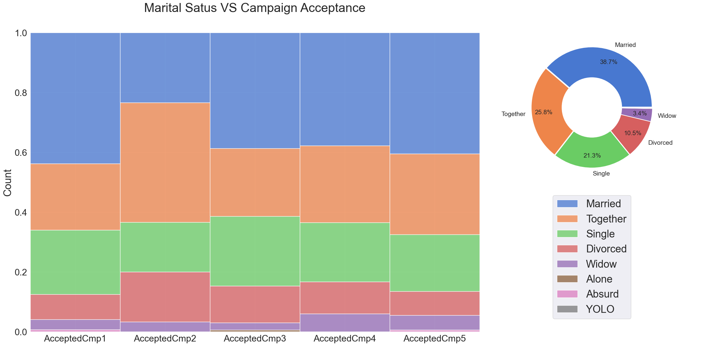
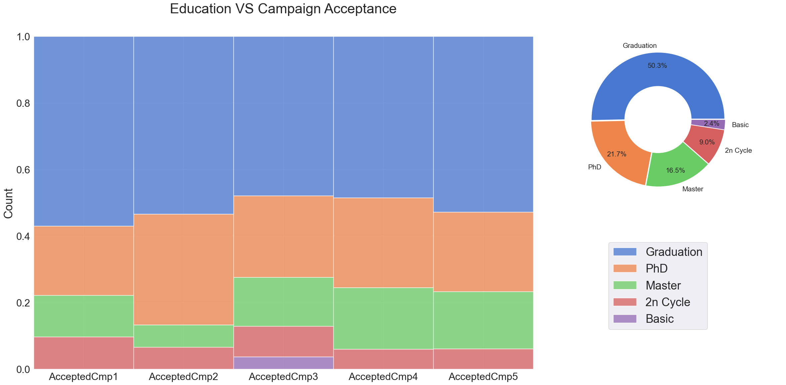
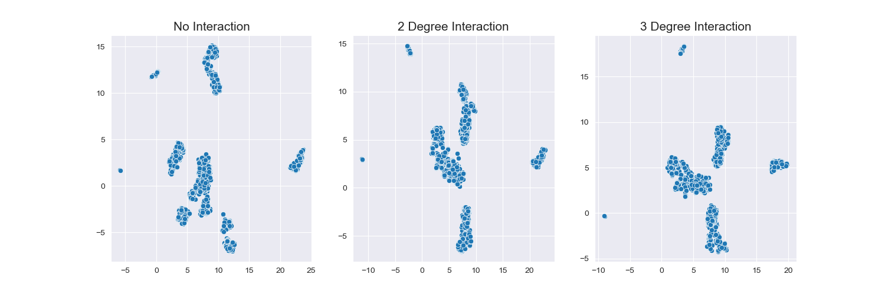

# **Customer Segmentation Analysis Report**

## **Main Objective**
The primary objective of this analysis is to perform **customer segmentation** using unsupervised learning techniques, specifically **clustering**, to divide customers into distinct groups based on their purchasing habits, income, and family status. This segmentation will help businesses tailor marketing strategies, improve customer targeting, and optimize resource allocation by focusing on high-potential customer groups.

### **Benefits to Stakeholders:**
- **Precise Targeting:** Ensures marketing campaigns reach the most relevant audience.
- **Improved Customer Experience:** Personalized promotions based on customer behavior.
- **Efficient Resource Allocation:** Focuses efforts on high-value customer segments.

---

## **Dataset Description**
The dataset used is **`marketing_campaign.csv`**, containing customer purchase history and demographic information. Key attributes include:
- **Demographics:** `Year_Birth`, `Education`, `Marital_Status`, `Income`, `Kidhome`, `Teenhome`
- **Purchase Behavior:** `MntWines`, `MntFruits`, `MntMeatProducts`, `MntFishProducts`, `MntSweetProducts`, `MntGoldProds`
- **Marketing Campaign Responses:** `AcceptedCmp1`–`AcceptedCmp5`, `Response`
- **Recency & Engagement:** `Recency`, `NumWebPurchases`, `NumCatalogPurchases`, `NumStorePurchases`

### **Goals:**
1. **Cluster customers** based on purchasing habits, income, and family status.
2. **Identify key segments** to optimize marketing strategies.
3. **Determine which campaigns** resonate best with each segment.

---

## **Data Exploration & Feature Engineering**
### **Data Cleaning & Transformations:**
1. **Handling Missing Values:**  
   - `Income` had missing values, which were dropped.
2. **Feature Engineering:**  
   - **Age Calculation:** Derived from `Year_Birth` (`Age = 2015 - Year_Birth`).  
   - **Customer Tenure:** Calculated from `Dt_Customer` (first purchase date).  
   - **Encoding Categorical Variables:**  
     - `Marital_Status` (One-Hot Encoded).  
     - `Education` (Ordinal Encoded: `Basic=0`, `Graduation=1`, `2n Cycle=2`, `Master=3`, `PhD=4`).  
3. **Subset Selection:**  
   - Only relevant features for clustering were retained.

### **Exploration:**
1. **Campaign Acceptance Distribution** 
2. **Feature Correlation** 
3. **Distribution of Each campaign over Feature** 
   
  
4. **Marriage Status vs Campaign Acceptanc**
   
5. **Education vs Campaign Acceptanc**
   
6. **Uniform Mainfold Approximation and Projection of Features with Different Degree of Interaction**
   
---
## **Preprocesing Steps**
1. **Standardizing**: Data is used stanradizes by z-score stndardization.
2. **Polynomial Feature**: 1-2 degree intearaction is considred.
3. **Dimensionality Reduction**: UMAP is used to reduce dimensionality. 
## **Model Training & Clustering Techniques**
Three clustering models were tuned to get best silhouette score or DBCV score. 
1. **HDBSCAN**  
   - CLusterer: 
    ```
    hdb_pipe = Pipeline([
        ('ss1',StandardScaler().set_output(transform='pandas')),
        ('poly',PolynomialFeatures().set_output(transform='pandas')),
        ('umap',umap.UMAP(random_state=seed)),
        ('hdb',HDBSCAN(gen_min_span_tree=True))
    ])
    ```
   - Hyperparameters:
   ```
    {'poly__degree': 2,
    'umap__n_neighbors': 5,
    'umap__n_components': 7,
    'umap__min_dist': 0.02760263810252339,
    'umap__metric': 'cosine',
    'hdb__min_cluster_size': 6,
    'hdb__min_samples': 20}
    ``` 
   - DBCV Score: 0.57
   - Summary:
     
     
     Campaigns and suggested clusters
     - Campaign 1: [8, 11],
     - Campaign 2: [],
     - Campaign 3: [3, 6],
     - Campaign 4: [1, 8, 9, 12],
     - Campaign 5: [8, 11]
2. **Spectral Clustering**  
   - CLusterer: 
    ```
    sc_pipe = Pipeline([
    ('ss1',StandardScaler().set_output(transform='pandas')),
    ('poly',PolynomialFeatures().set_output(transform='pandas')),
    ('umap',umap.UMAP(random_state=seed)),
    ('sc',SpectralClustering(random_state=seed,n_jobs=-1))
    ])
    ```
   - Hyperparameters:
   ```
    {'poly__degree': 2,
    'umap__n_neighbors': 39,
    'umap__n_components': 7,
    'umap__min_dist': 0.010291734792165141,
    'umap__metric': 'cosine',
    'sc__n_clusters': 12,
    'sc__n_components': 7,
    'sc__affinity': 'rbf',
    'sc__gamma': 0.9206138163299464,
    'sc__n_neighbors': 32}
    ``` 
   - Silhouette Score: 0.61 
   - Summary:
     
      
     
     Campaigns and suggested clusters
     - Campaign 1: [7, 8, 9],
     - Campaign 2: [],
     - Campaign 3: [],
     - Campaign 4: [3, 4, 7, 9, 11],
     - Campaign 5: [7, 8, 9]

3. **Agglomerative  Clustering**  
   - CLusterer: 
    ```
    ac_pipe = Pipeline([
    ('ss1',StandardScaler().set_output(transform='pandas')),
    ('poly',PolynomialFeatures().set_output(transform='pandas')),
    ('umap',umap.UMAP(random_state=seed)),
    ('ac',AgglomerativeClustering())
    ])
    ```
   - Hyperparameters:
   ```
    {'poly__degree': 2,
    'umap__n_neighbors': 5,
    'umap__n_components': 5,
    'umap__min_dist': 0.021055690533401124,
    'umap__metric': 'cosine',
    'ac__n_clusters': 12,
    'ac__linkage': 'ward'}
    ``` 
   - Silhouette Score: .70  
   - Summary:
     
     
     Campaigns and suggested clusters
     - Campaign 1: [2, 8],
     - Campaign 2: [],
     - Campaign 3: [5],
     - Campaign 4: [1, 2, 7],
     - Campaign 5: [1, 2, 8]
---

## **Recommended Model**
**Agglomerative Clustering** is recommended due to:
- **Clear Separation:** Well-defined clusters.  
- **Interpretability:** Easier to assign business meaning to segments.  
- **Scalability:** Efficient for large datasets.  

### **Key Segments Identified:**
1. **High-Income, High-Spending** (Target for premium campaigns).  
2. **Moderate-Income, Frequent Buyers** (Loyalty programs).  
3. **Low-Income, Occasional Buyers** (Discount-focused campaigns).  

---

## **Key Findings & Insights**
1. **Income & Spending Correlation:** Higher-income customers spend more on wines and meat.  
2. **Family Impact:** Households with kids spend less on luxury items.  
3. **Campaign Effectiveness:** **Campaign 5** had the highest response rate.  

---

## **Next Steps**
1. **Enhance Features:** Include more behavioral data (e.g., browsing history).  
2. **Dynamic Segmentation:** Use real-time data for adaptive clustering.  
3. **A/B Testing:** Validate campaign effectiveness per segment.  

---

### **Conclusion**
This analysis successfully segments customers into actionable groups, enabling targeted marketing strategies. The **K-Means model** provides the most business-friendly clusters, while further refinements can enhance precision.   

